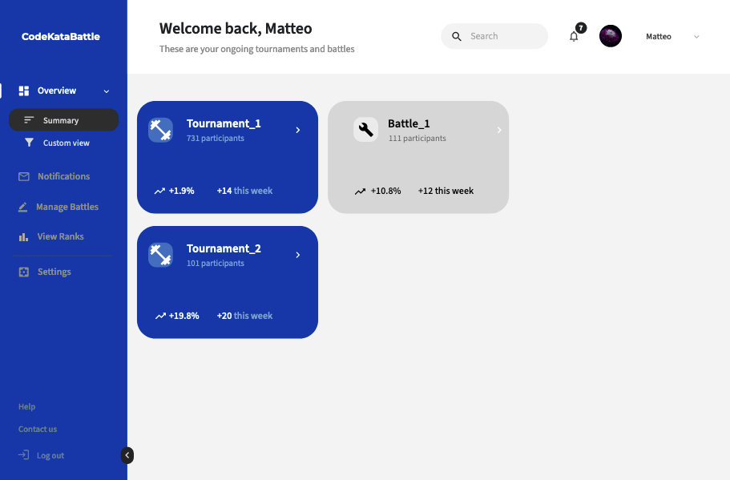
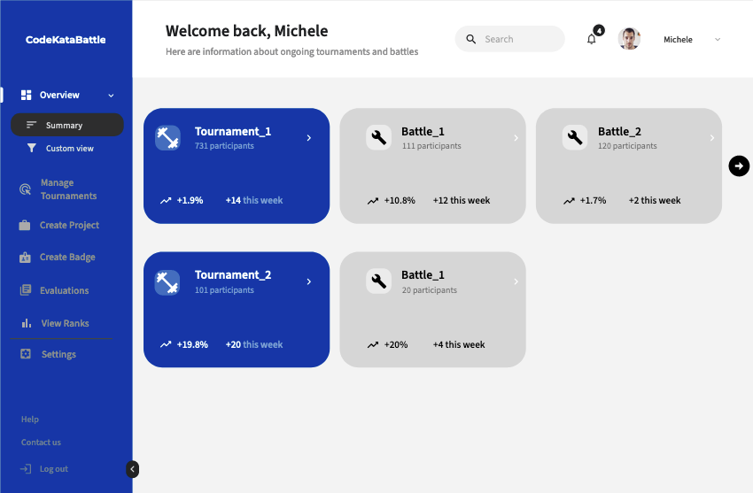
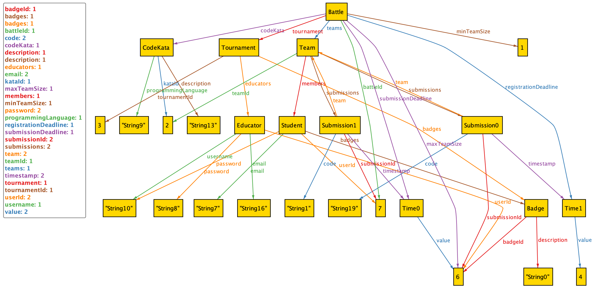
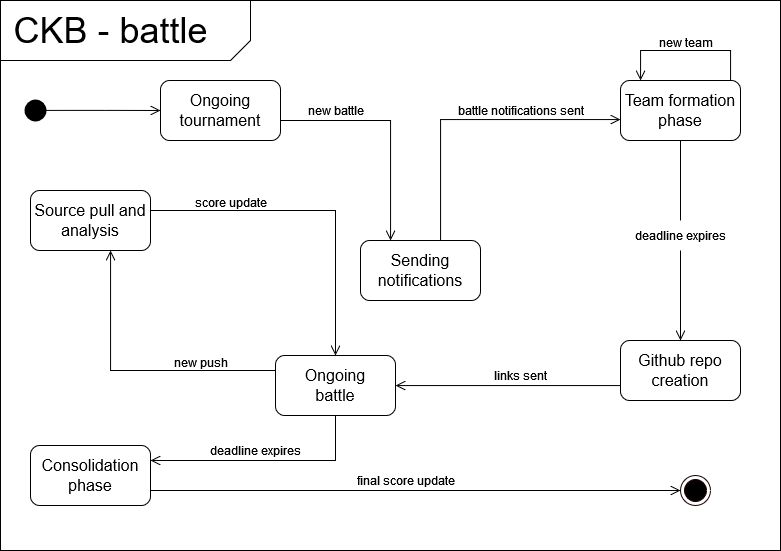
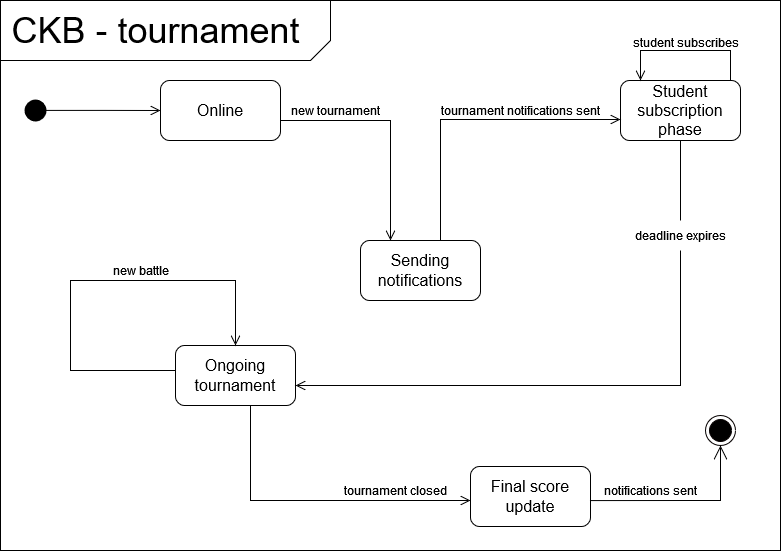
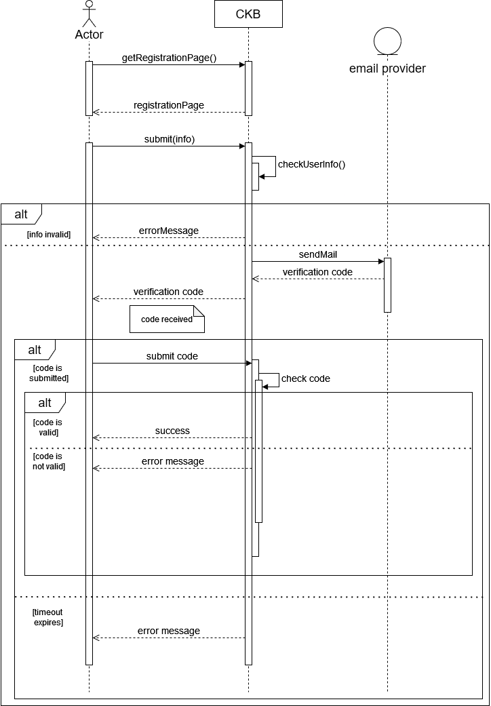
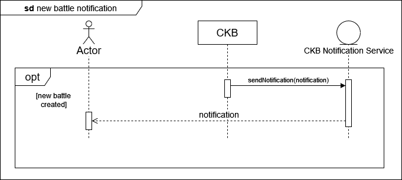
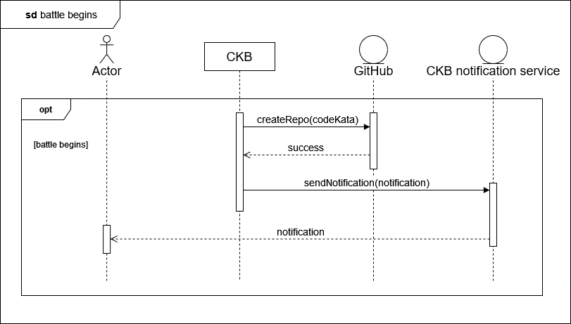
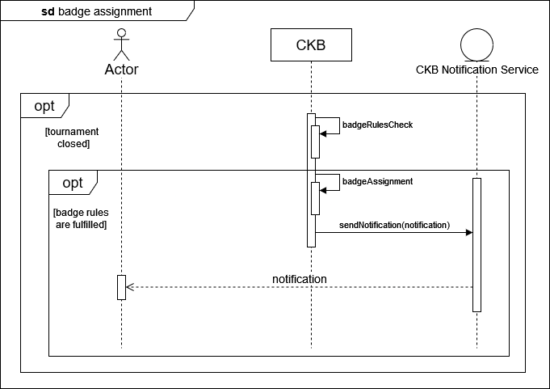
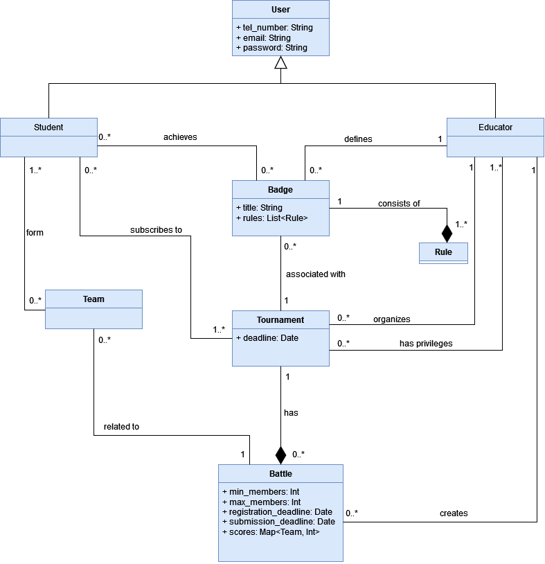

# CODEKATABATTLE
Formal analysis, requirements engineering and Design Document for the CodeKataBattle application
 
## VIEW

   
   
   
   

## ALLOY

   
## STATE DIAGRAMS

## SEQUENCE DIAGRAMS

 

 

 

## USE CASE DIAGRAMS

   
